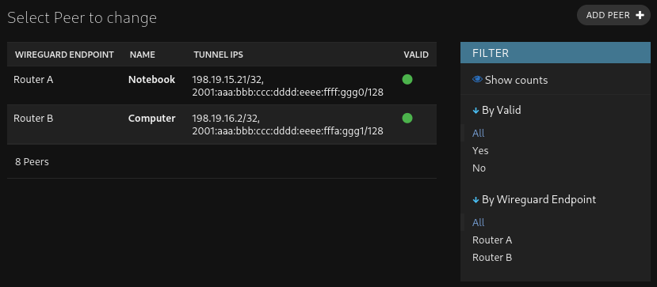
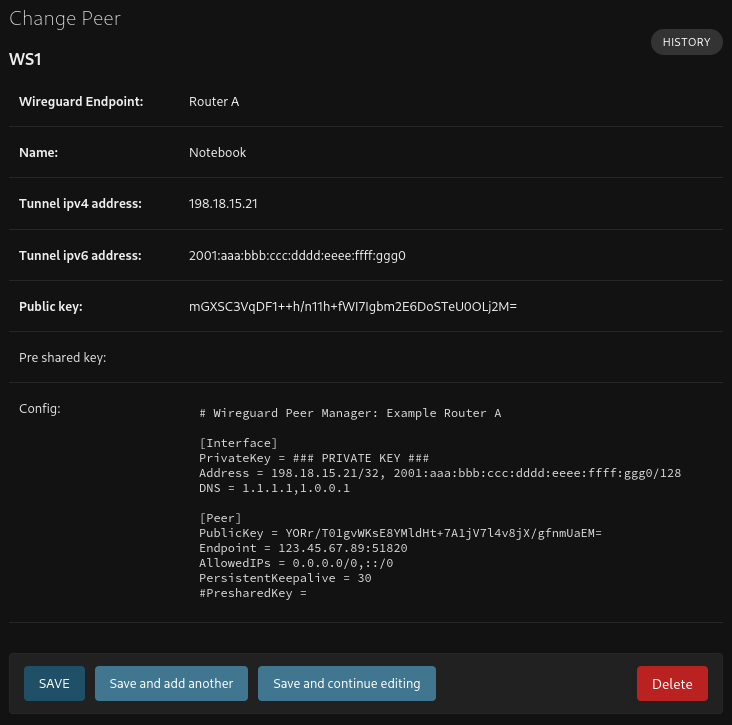
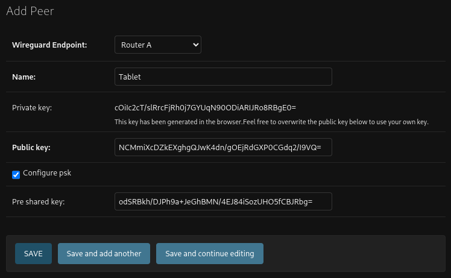

# Wireguard Peer Manager

Wireguard Peer Manager is used for managing Road Warrior VPN endpoints and consists of two components. Users and 
administrators utilize a Web Application for graphical management of Wireguard peers. It communicates with the router's 
REST API to apply the Wireguard configuration.

After the user logs in, they can easily create new Wireguard peers (each device should have its own peer to enable 
simultaneous connections) and view or delete the Wireguard configuration. Due to this abstraction layer, end-users don't
need access to the router to manage their peers but also don't have to open a ticket every time they want to make a new 
device VPN-enabled.

When creating new peers, the browser generates an asymmetric key pair upon the user's request and also a pre-shared key
(PSK), which needs to be set up on both sides for the tunnel to function. The private key is not sent to the server and 
not stored in the browser, so the user must save it directly.

Afterward, the user sees the newly created peer in the list of registered peers with a red status indicator. Once it
changes to green (usually taking no longer than 30 seconds), the peer is usable.

All clients connecting to the same router use the same Wireguard endpoint (in our case, the interface `wg100`), 
differing only in the IPv4 and IPv6 addresses used within the tunnel.

## Router API
- [OpenAPI Specification](https://editor.swagger.io/?url=https://raw.githubusercontent.com/secshellnet/wpm-api-vyos/main/spec.yaml)
- [Implementation for Vyatta / VyOS](https://github.com/secshellnet/wpm-api-vyos)

## Webinterface

